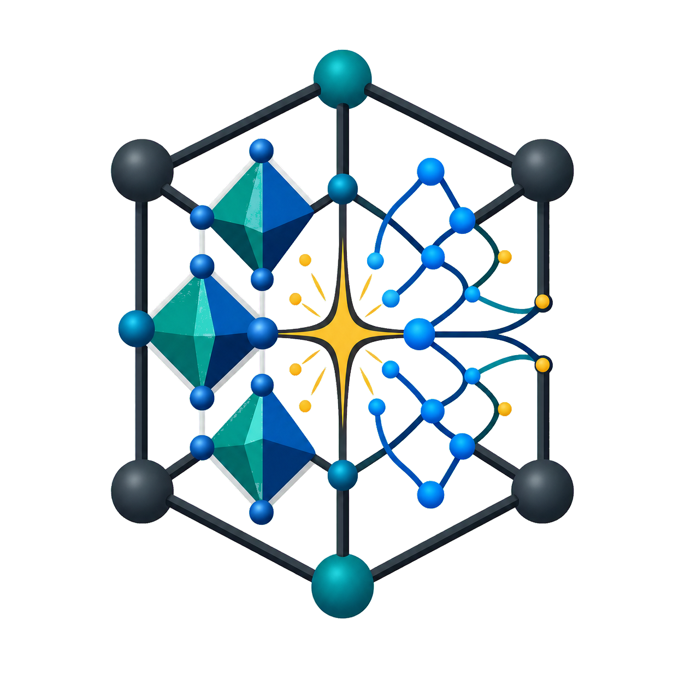

# Awesome Generative AI for Material Discovery

<p align="center">
  <a href="https://github.com/yanliang3612/Awesome-Generative-AI-for-Material-Discovery">
    
  </a>
  <a href="https://zhuanlan.zhihu.com/p/2058955167744136801">
    
  </a>
  <a href="https://join.slack.com/t/matdiscoverai/shared_invite/zt-32kktcuk0-XaaJT2P9qZTfNdaCzJUGAg">
    
  </a>
  <a href="#join-the-wechat-group">
    
  </a>
  <a href="https://opensource.org/licenses/MIT">
    
  </a>
</p>

<p align="center">
  
</p>

<p align="center">
  <strong>A curated collection of algorithms, surveys, datasets, benchmarks, and toolkits for generative AI in material discovery.</strong><br>
  <em>If this saves you even one night of paper-hunting, give us a ⭐ — it's cheaper than a GPU hour, needs no DFT convergence, and finishes in one click.</em><br>
  <a href="#community">
    
  </a>
</p>

<table align="center">
  <tr>
    <td align="center">
      <a href="https://join.slack.com/t/matdiscoverai/shared_invite/zt-32kktcuk0-XaaJT2P9qZTfNdaCzJUGAg">
        
      </a>
      <br>
      <strong>SciGenAI Slack</strong>
    </td>
    <td align="center">
      
      <br>
      <strong>WeChat Group</strong>
    </td>
  </tr>
</table>

<p align="center">
  <a href="https://github.com/yanliang3612/Awesome-Generative-AI-for-Material-Discovery">Project Page</a>
  |
  <a href="https://zhuanlan.zhihu.com/p/2058955167744136801">Zhihu Blog</a>
  |
  <a href="#community">Community</a>
  |
  <a href="#awesome-algorithms">Algorithms</a>
  |
  <a href="#awesome-surveys-datasets-benchmarks--toolkits">Surveys & Resources</a>
  |
  <a href="#citation">Citation</a>
</p>

Last updated: 2026-07-24

---

## Table of Contents

- [Overview](#overview)
- [Awesome Algorithms](#awesome-algorithms)
  - [Large Language Models](#large-language-models)
  - [Agentic Materials Discovery](#agentic-materials-discovery)
  - [GAN Models](#gan-models)
  - [Diffusion Models](#diffusion-models)
  - [Flow Matching Models](#flow-matching-models)
  - [Bayesian & Generative Flow Networks](#bayesian--generative-flow-networks)
  - [Symmetry-Aware & Wyckoff Generation](#symmetry-aware--wyckoff-generation)
  - [Autoencoder & VAE Models](#autoencoder--vae-models)
  - [MOF & Porous Materials](#mof--porous-materials)
  - [Representation & Pretraining](#representation--pretraining)
  - [Multi-Modal Training & Learning](#multi-modal-training--learning)
- [Awesome Surveys, Datasets, Benchmarks & Toolkits](#awesome-surveys-datasets-benchmarks--toolkits)
  - [Surveys](#surveys)
  - [Datasets](#datasets)
  - [Benchmarks](#benchmarks)
  - [Toolkits](#toolkits)
- [TODO](#todo)
- [Acknowledgements](#acknowledgements)
- [Community](#community)
- [Citation](#citation)
- [Contact](#contact)

---

## Overview

This repository tracks progress in generative AI for materials, including language-model-based crystal generation, adversarial, diffusion and flow-matching models, Bayesian and generative flow networks, VAE-style generators, multimodal materials learning, agentic discovery workflows, foundation models, and evaluation resources.

**Legend:** In `Awesome Algorithms`, `Code` links to implementations or official repositories and `Demo` links to project pages, web apps, or documentation. Resource sections use type-specific columns for companion material, data, evaluation suites, and software.

## Awesome Algorithms

This section is limited to work whose primary contribution is a model, algorithm, representation, training method, or autonomous discovery workflow.

### Large Language Models

| Title | Venue | Date | Code | Demo |
| - | - | - | - | - |
| [**Crystal Transformer: Self-learning neural language model for Generative and Tinkering Design of Materials**](https://arxiv.org/abs/2204.11953) | arXiv 2022 | 2022.04.25 | - | - |
| [**Material Transformers: Deep Learning Language Models for Generative Materials Design**](https://arxiv.org/abs/2206.13578) | Machine Learning: Science and Technology 2023 | 2022.06.27 | - | - |
| [**Language models can generate molecules, materials, and protein binding sites directly in three dimensions as XYZ, CIF, and PDB files**](https://arxiv.org/abs/2305.05708) | arXiv 2023 | 2023.05.09 | - | - |
| <br>[**Fine-Tuned Language Models Generate Stable Inorganic Materials as Text**](https://arxiv.org/abs/2402.04379) | ICLR 2024 | 2024.02.06 | [GitHub](https://github.com/facebookresearch/crystal-text-llm) | - |
| <br>[**Crystal structure generation with autoregressive large language modeling**](https://www.nature.com/articles/s41467-024-54639-7) | Nature Communications 2024 | 2024.11.28 | [GitHub](https://github.com/lantunes/CrystaLLM) | - |
| <br>[**AtomGPT: Atomistic Generative Pre-trained Transformer for Forward and Inverse Materials Design**](https://arxiv.org/abs/2405.03680) | arXiv 2024 | 2024.05.06 | [GitHub](https://github.com/usnistgov/atomgpt) | - |
| <br>[**Integrating Chemistry Knowledge in Large Language Models via Prompt Engineering**](https://arxiv.org/abs/2404.14467) | arXiv 2024 | 2024.05.22 | [GitHub](https://github.com/harrylaucngd/prompt-eng-master) | - |
| <br>[**LLMatDesign: Autonomous Materials Discovery with Large Language Models**](https://arxiv.org/abs/2406.13163) | arXiv 2024 | 2024.06.19 | [GitHub](https://github.com/Fung-Lab/LLMatDesign) | - |
| <br>[**MatterGPT: A Generative Transformer for Multi-Property Inverse Design of Solid-State Materials**](https://arxiv.org/abs/2408.07608) | arXiv 2024 | 2024.08.14 | [GitHub](https://github.com/xiaohang007/SLICES/tree/main/MatterGPT) | - |
| <br>[**Invariant Tokenization of Crystalline Materials for Language Model Enabled Generation**](https://proceedings.neurips.cc/paper_files/paper/2024/hash/e23133d34964a0a09f6d076fc4b922a4-Abstract-Conference.html) | NeurIPS 2024 | 2025.02.28 | [GitHub](https://github.com/divelab/AIRS/tree/main/OpenMat/Mat2Seq) | - |
| <br>[**Large Language Models Are Innate Crystal Structure Generators**](https://arxiv.org/abs/2502.20933) | ICLR 2025 Workshop AgenticAI Oral | 2025.02.28 | [GitHub](https://github.com/JingruG/MatLLMSearch) | - |
| <br>[**A generative material transformer using Wyckoff representation**](https://www.nature.com/articles/s41524-025-01940-8) | npj Computational Materials 2026 | 2026.01.23 | [GitHub](https://github.com/ppdebreuck/matra-genoa) | - |
| [**CrystalICL: Enabling In-Context Learning for Crystal Generation**](https://arxiv.org/abs/2508.20143) | EMNLP 2025 | 2025.08.27 | - | - |
| <br>[**LLM Meets Diffusion: A Hybrid Framework for Crystal Material Generation**](https://openreview.net/forum?id=E6gwPtWjb1) | NeurIPS 2025 | 2025.09.18 | [GitHub](https://github.com/kdmsit/crysllmgen) | - |
| <br>[**Synthesis-Aware Materials Redesign via Large Language Models**](https://pubs.acs.org/doi/10.1021/jacs.5c07743) | Journal of the American Chemical Society 2025 | 2025.10.06 | [GitHub](https://github.com/snu-micc/SynCry) | - |
| <br>[**PLaID++: A Preference Aligned Language Model for Targeted Inorganic Materials Design**](https://openreview.net/forum?id=wFThVGzmvq) | ICML 2026 | 2026.04.30 | [GitHub](https://github.com/andaero/PLaID) | - |
| [**MatMind: A Structure-Activity Knowledge-Driven Generative Foundation Model for Materials Science**](https://arxiv.org/abs/2606.07712) | arXiv 2026 | 2026.06.05 | - | - |
| [**LapidaryEngine: Fully Conversational Crystal Generation**](https://arxiv.org/abs/2606.14215) | arXiv 2026 | 2026.06.12 | - | - |
| [**Atomistic Language Models Understand and Generate Materials**](https://arxiv.org/abs/2606.21395) | arXiv 2026 | 2026.06.19 | - | - |
| [**Reaction-network reasoning with frontier models for experimentally confirmed catalyst-selectivity hypotheses**](https://arxiv.org/abs/2607.08003) | arXiv 2026 | 2026.07.09 | - | - |
| [**How Well Can Frontier Large Language Models Generate Structures? High Quality Prediction of Molecular Geometries with Help from Fine-Tuning**](https://arxiv.org/abs/2607.13350) | arXiv 2026 | 2026.07.15 | - | - |
| [**Atomic Design Transformer: Scaffold-Conditioned 3D Molecule Generation via xTB-Reward Reinforcement Learning**](https://arxiv.org/abs/2607.15918) | arXiv 2026 | 2026.07.17 | - | - |

### Agentic Materials Discovery

| Title | Venue | Date | Code | Demo |
| - | - | - | - | - |
| <br>[**LLMatDesign: Autonomous Materials Discovery with Large Language Models**](https://arxiv.org/abs/2406.13163) | arXiv 2024 | 2024.06.19 | [GitHub](https://github.com/Fung-Lab/LLMatDesign) | - |
| <br>[**Automating alloy design and discovery with physics-aware multimodal multiagent AI**](https://doi.org/10.1073/pnas.2414074122) | Proceedings of the National Academy of Sciences 2025 | 2024.07.13 | [GitHub](https://github.com/lamm-mit/AtomAgents) | - |
| [**GenMS: Generative Hierarchical Materials Search**](https://arxiv.org/abs/2409.06762) | NeurIPS 2024 | 2024.09.10 | - | [Demo](https://generative-materials.github.io/genms/) |
| <br>[**Multicrossmodal Automated Agent for Integrating Diverse Materials Science Data**](https://arxiv.org/abs/2505.15132) | arXiv 2025 | 2025.05.21 | [GitHub](https://github.com/adibgpt/Multicrossmodal-Autonomous-Materials-Science-Agent) | - |
| [**"DIVE" into Hydrogen Storage Materials Discovery with AI Agents**](https://arxiv.org/abs/2508.13251) | arXiv 2025 | 2025.08.18 | - | - |
| <br>[**LLEMA: Evolutionary Search with LLMs for Multi-Objective Materials Discovery**](https://openreview.net/forum?id=TIqzhBvCNB) | ICLR 2026 | 2025.10.26 | [GitHub](https://github.com/scientific-discovery/LLEMA) | - |
| [**PolyJarvis: An LLM-Orchestrated Agent for Automated All-Atom Molecular Dynamics of Amorphous Homopolymers**](https://arxiv.org/abs/2604.02537) | arXiv 2026 | 2026.04.02 | - | - |
| [**Reasoning-to-Simulation: An Agentic Framework for Discovery of Electrolyte Materials**](https://openreview.net/forum?id=MEXl18VhBL) | AI4Mat-ICLR 2026 | 2026.03.02 | - | - |
| [**Generative Discovery of Magnetic Insulators under Competing Physical Constraints**](https://arxiv.org/abs/2604.21073) | arXiv 2026 | 2026.04.22 | - | - |
| [**AdsMind: A Physics-Grounded Multi-Agent System for Self-Correcting Discovery of Adsorption Configurations on Heterogeneous Catalyst Surfaces**](https://arxiv.org/abs/2606.19152) | arXiv 2026 | 2026.06.17 | - | - |
| [**Human and LLM Collaboration for Accelerated Materials Synthesis and Discovery**](https://arxiv.org/abs/2607.07604) | arXiv 2026 | 2026.07.08 | - | - |
| [**Autonomous in-silico inorganic materials discovery via multi-agent physics-aware scientific reasoning**](https://doi.org/10.1038/s41524-026-02205-8) | npj Computational Materials 2026 | 2026.07.08 | - | - |
| [**Large language model agents accelerate inverse design of metal-organic frameworks for gas separation**](https://arxiv.org/abs/2607.10559) | arXiv 2026 | 2026.07.12 | - | - |
| [**Symbolic Predicate-Guided Language Agents for Inverse Design of Perovskite Oxides**](https://arxiv.org/abs/2607.15535) | arXiv 2026 | 2026.07.17 | - | - |

### GAN Models

| Title | Venue | Date | Code | Demo |
| - | - | - | - | - |
| [**Generative adversarial networks (GAN) based efficient sampling of chemical composition space for inverse design of inorganic materials**](https://www.nature.com/articles/s41524-020-00352-0) | npj Computational Materials 2020 | 2020.06.26 | - | - |
| <br>[**Generative Adversarial Networks for Crystal Structure Prediction**](https://pubs.acs.org/doi/10.1021/acscentsci.0c00426) | ACS Central Science 2020 | 2020.07.10 | [GitHub](https://github.com/kaist-amsg/Composition-Conditioned-Crystal-GAN) | - |
| [**Constrained crystals deep convolutional generative adversarial network for the inverse design of crystal structures**](https://arxiv.org/abs/2007.11228) | npj Computational Materials 2021 | 2020.07.22 | - | - |
| <br>[**High-throughput discovery of novel cubic crystal materials using deep generative neural networks**](https://arxiv.org/abs/2102.01880) | Advanced Science 2021 | 2021.02.03 | [GitHub](https://github.com/MilesZhao/CubicGAN) | [Database](http://www.carolinamatdb.org/) |
| <br>[**Physics Guided Deep Learning for Generative Design of Crystal Materials with Symmetry Constraints**](https://arxiv.org/abs/2203.14352) | npj Computational Materials 2023 | 2022.03.27 | [GitHub](https://github.com/MilesZhao/PGCGM) | - |
| [**Inverse Design of Tunable Infrared Metasurface Absorbers via a Conditional Wasserstein Generative Adversarial Network**](https://doi.org/10.1002/adom.71441) | Advanced Optical Materials 2026 | 2026.07.14 | - | - |

### Diffusion Models

| Title | Venue | Date | Code | Demo |
| - | - | - | - | - |
| <br>[**Crystal Structure Prediction by Joint Equivariant Diffusion**](https://arxiv.org/abs/2309.04475) | NeurIPS 2023 | 2023.07.30 | [GitHub](https://github.com/jiaor17/DiffCSP) | - |
| <br>[**MOFDiff: Coarse-grained Diffusion for Metal-Organic Framework Design**](https://arxiv.org/abs/2310.10732) | ICLR 2024 | 2023.10.16 | [GitHub](https://github.com/microsoft/MOFDiff) | - |
| <br>[**Data-Driven Score-Based Models for Generating Stable Structures with Adaptive Crystal Cells**](https://arxiv.org/abs/2310.10695) | Journal of Chemical Information and Modeling 2023 | 2023.10.16 | [GitHub](https://github.com/findooshka/diffusion-atoms) | - |
| [**UniMat: Scalable Diffusion for Materials Generation**](https://arxiv.org/abs/2311.09235) | arXiv 2023 | 2023.11.15 | - | [Demo](https://unified-materials.github.io/unimat/) |
| <br>[**MatterGen: A Generative Model for Inorganic Materials Design**](https://arxiv.org/abs/2312.03687) | Nature 2025 | 2023.12.06 | [GitHub](https://github.com/microsoft/mattergen) | - |
| <br>[**Space Group Constrained Crystal Generation**](https://arxiv.org/abs/2402.03992) | ICLR 2024 | 2024.02.06 | [GitHub](https://github.com/jiaor17/DiffCSP-PP) | - |
| <br>[**Structural constraint integration in a generative model for the discovery of quantum materials**](https://arxiv.org/abs/2407.04557) | Nature Materials 2026 | 2024.07.05 | [GitHub](https://github.com/RyotaroOKabe/SCIGEN) | - |
| <br>[**Equivariant Diffusion for Crystal Structure Prediction**](https://dl.acm.org/doi/10.5555/3692070.3693274) | ICML 2024 | 2024.07.21 | [GitHub](https://github.com/EmperorJia/EquiCSP) | - |
| [**Discovery of 2D Materials via Symmetry-Constrained Diffusion Model**](https://doi.org/10.1021/acs.jpcc.4c08681) | J. Phys. Chem. C 2025 | 2024.12.24 | - | - |
| [**Generative Design of Crystal Structures by Point Cloud Representations and Diffusion Model**](https://doi.org/10.1016/j.isci.2024.111659) | iScience 2025 | 2025.01.17 | - | - |
| [**Atomistic Generative Diffusion for Materials Modeling**](https://arxiv.org/abs/2501.08117) | arXiv 2025 | 2025.01.14 | - | - |
| <br>[**CrystalGRW: Generative Modeling of Crystal Structures with Targeted Properties via Geodesic Random Walks**](https://arxiv.org/abs/2501.08998) | arXiv 2025 | 2025.01.15 | [GitHub](https://github.com/trachote/crystalgrw) | - |
| [**DiffCrysGen: a generative diffusion model for accelerated design of inorganic crystalline materials**](https://www.nature.com/articles/s41524-026-02147-1) | npj Computational Materials 2026 | 2026.05.27 | [GitHub](https://github.com/SouravMal/DiffCrysGen) | [Demo](https://github.com/SouravMal/DiffCrysGen/blob/main/notebooks/DiffCrysGen-demo.ipynb) |
| <br>[**Periodic Materials Generation using Text-Guided Joint Diffusion Model**](https://openreview.net/forum?id=AkBrb7yQ0G) | ICLR 2025 | 2025.02.28 | [GitHub](https://github.com/kdmsit/TGDMat) | - |
| <br>[**All-atom Diffusion Transformers: Unified generative modelling of molecules and materials**](https://arxiv.org/abs/2503.03965) | ICML 2025 | 2025.03.05 | [GitHub](https://github.com/facebookresearch/all-atom-diffusion-transformer) | - |
| <br>[**Kinetic Langevin Diffusion for Crystalline Materials Generation**](https://openreview.net/forum?id=7J1kwZY72h) | ICML 2025 | 2025.05.01 | [GitHub](https://github.com/frcnt/kldm) | - |
| <br>[**Exploration of crystal chemical space using text-guided generative artificial intelligence**](https://www.nature.com/articles/s41467-025-59636-y) | Nature Communications 2025 | 2025.05.12 | [GitHub](https://github.com/hspark1212/chemeleon) | - |
| <br>[**InvDesFlow-AL: active learning-based workflow for inverse design of functional materials**](https://arxiv.org/abs/2505.09203) | npj Computational Materials 2025 | 2025.05.14 | [GitHub](https://github.com/xqh19970407/InvDesFlow-AL) | - |
| <br>[**A generative diffusion model for amorphous materials**](https://arxiv.org/abs/2507.05024) | npj Computational Materials 2026 | 2025.07.07 | [GitHub](https://github.com/digital-synthesis-lab/DM2) | - |
| [**Enhancing Materials Discovery with Valence Constrained Design in Generative Modeling**](https://arxiv.org/abs/2507.19799) | arXiv 2025 | 2025.07.26 | - | - |
| <br>[**CrystalDiT: Simple Diffusion Transformers for Crystal Generation**](https://ojs.aaai.org/index.php/AAAI/article/view/37121) | AAAI 2026 | 2026.03.14 | [GitHub](https://github.com/hanyi2021/CrystalDiT) | - |
| <br>[**Space Group Equivariant Crystal Diffusion**](https://openreview.net/forum?id=NWP8KYKC0c) | NeurIPS 2025 | 2025.09.18 | [GitHub](https://github.com/rees-c/sgequidiff) | - |
| <br>[**LLM Meets Diffusion: A Hybrid Framework for Crystal Material Generation**](https://openreview.net/forum?id=E6gwPtWjb1) | NeurIPS 2025 | 2025.09.18 | [GitHub](https://github.com/kdmsit/crysllmgen) | - |
| <br>[**DiffSyn: a generative diffusion approach to materials synthesis planning**](https://arxiv.org/abs/2509.17094) | Nature Computational Science 2026 | 2025.09.21 | [GitHub](https://github.com/eltonpan/zeosyn_gen) | - |
| [**Guided diffusion for the discovery of new superconductors**](https://arxiv.org/abs/2509.25186) | npj Computational Materials 2026 | 2025.09.29 | - | - |
| <br>[**MiAD: Mirage Atom Diffusion for De Novo Crystal Generation**](https://arxiv.org/abs/2511.14426) | arXiv 2025 | 2025.11.18 | [GitHub](https://github.com/andrey-okhotin/miad) | - |
| <br>[**OXtal: An All-Atom Diffusion Model for Organic Crystal Structure Prediction**](https://openreview.net/forum?id=6Jd5aBml0y) | ICLR 2026 | 2026.01.26 | [GitHub](https://github.com/OXtal/OXtal) | [Demo](https://oxtal.github.io/) |
| <br>[**Crystalite: A Lightweight Transformer for Efficient Crystal Modeling**](https://arxiv.org/abs/2604.02270) | arXiv 2026 | 2026.04.02 | [GitHub](https://github.com/joshrosie/crystalite) | - |
| [**Finetuning-Free Diffusion Model with Adaptive Constraint Guidance for Inorganic Crystal Structure Generation**](https://arxiv.org/abs/2604.13354) | arXiv 2026 | 2026.04.14 | - | - |
| <br>[**Guiding generative models to uncover diverse and novel crystals via reinforcement learning**](https://www.nature.com/articles/s42256-026-01262-4) | Nature Machine Intelligence 2026 | 2026.07.06 | [GitHub](https://github.com/hspark1212/chemeleon2) | [Docs](https://hspark1212.github.io/chemeleon2/) |
| [**Data-efficient continuous conditional denoising diffusion model for microstructure generation**](https://arxiv.org/abs/2607.10429) | arXiv 2026 | 2026.07.11 | - | - |

### Flow Matching Models

| Title | Venue | Date | Code | Demo |
| - | - | - | - | - |
| <br>[**An Equivariant Flow Matching Framework for Learning Molecular Crystallization**](https://openreview.net/forum?id=lCVqpQvr4l) | ICML 2024 Workshop | 2024.06.17 | [GitHub](https://github.com/chao1224/CrystalFlow) | - |
| <br>[**FlowMM: Generating Materials with Riemannian Flow Matching**](https://arxiv.org/abs/2406.04713) | ICML 2024 | 2024.07.07 | [GitHub](https://github.com/facebookresearch/flowmm) | - |
| <br>[**FlowLLM: Flow Matching for Material Generation with Large Language Models as Base Distributions**](https://arxiv.org/abs/2410.23405) | NeurIPS 2024 | 2024.10.30 | [GitHub](https://github.com/facebookresearch/flowmm) | - |
| <br>[**CrystalFlow: a flow-based generative model for crystalline materials**](https://www.nature.com/articles/s41467-025-64364-4) | Nature Communications 2025 | 2024.12.16 | [GitHub](https://github.com/ixsluo/CrystalFlow) | - |
| <br>[**Open Materials Generation with Stochastic Interpolants**](https://openreview.net/forum?id=gHGrzxFujU) | ICML 2025 | 2025.05.01 | [GitHub](https://github.com/FERMat-ML/OMatG) | - |
| [**Space Group Conditional Flow Matching**](https://arxiv.org/abs/2509.23822) | arXiv 2025 | 2025.09.28 | - | - |
| <br>[**Flexible MOF Generation with Torsion-Aware Flow Matching**](https://openreview.net/forum?id=cLJfumTWLI) | NeurIPS 2025 | 2025.05.23 | [GitHub](https://github.com/nayoung10/MOFFlow-2) | - |
| [**DMFlow: Disordered Materials Generation by Flow Matching**](https://arxiv.org/abs/2602.04734) | arXiv 2026 | 2026.02.04 | - | - |
| <br>[**CatFlow: Co-generation of Slab-Adsorbate Systems via Flow Matching**](https://arxiv.org/abs/2602.05372) | ICML 2026 | 2026.02.05 | [GitHub](https://github.com/minkyu1022/CatFlow) | - |
| [**Riemannian Variational Flow Matching for Material and Protein Design**](https://openreview.net/forum?id=NlnDselrtl) | ICLR 2026 | 2026.01.26 | - | - |
| <br>[**Open Materials Generation with Inference-Time Reinforcement Learning**](https://openreview.net/forum?id=82lQk0jw0c) | AI4Mat-ICLR 2026 Spotlight | 2026.03.02 | [GitHub](https://github.com/FERMat-ML/OMatG) | - |
| [**Multimodal Crystal Flow: Any-to-Any Modality Generation for Unified Crystal Modeling**](https://openreview.net/forum?id=lKyD1ulXpY) | ICML 2026 | 2026.04.30 | - | - |
| [**Generating Symmetric Materials using Latent Flow Matching**](https://arxiv.org/abs/2605.10115) | arXiv 2026 | 2026.05.11 | - | - |
| <br>[**Fast Organic Crystal Structure Prediction with Unit Cell Flow Matching**](https://arxiv.org/abs/2606.03199) | arXiv 2026 | 2026.06.02 | [GitHub](https://github.com/aspuru-guzik-group/clari) | [Models](https://huggingface.co/the-matter-lab/clari) |
| [**Joint Discrete-Continuous Flow Matching for Open-Vocabulary Inverse Design of Multilayer Optical Coatings**](https://arxiv.org/abs/2607.08392) | arXiv 2026 | 2026.07.09 | - | - |
| [**SinAE: A Single-Architecture Flow-Matching Autoencoder for Cross-Domain Atomic Systems**](https://arxiv.org/abs/2607.12380) | arXiv 2026 | 2026.07.14 | - | - |

### Bayesian & Generative Flow Networks

| Title | Venue | Date | Code | Demo |
| - | - | - | - | - |
| <br>[**Crystal-GFN: sampling crystals with desirable properties and constraints**](https://arxiv.org/abs/2310.04925) | AI4Mat-NeurIPS 2023 Spotlight | 2023.10.07 | [GitHub](https://github.com/alexhernandezgarcia/gflownet) | - |
| [**Hierarchical GFlowNet for Crystal Structure Generation**](https://openreview.net/forum?id=dJuDv4MKLE) | AI4Mat-NeurIPS 2023 | 2023.10.27 | - | - |
| <br>[**A Periodic Bayesian Flow for Material Generation**](https://openreview.net/forum?id=Lz0XW99tE0) | ICLR 2025 | 2025.02.04 | [GitHub](https://github.com/wu-han-lin/CrysBFN) | - |
| <br>[**MOF-BFN: Metal-Organic Frameworks Structure Prediction via Bayesian Flow Networks**](https://openreview.net/forum?id=pNwiFucAtA) | NeurIPS 2025 | 2025.09.18 | [GitHub](https://github.com/jiaor17/MOF-BFN) | - |
| <br>[**Efficient symmetry-aware materials generation via hierarchical generative flow networks**](https://pubs.rsc.org/en/content/articlehtml/2025/dd/d4dd00392f) | Digital Discovery 2026 | 2025.10.02 | [GitHub](https://github.com/ngminhtri0394/SHAFT) | - |
| <br>[**Symmetry-aware Bayesian flow networks for crystal generation**](https://www.nature.com/articles/s41524-026-02140-8) | npj Computational Materials 2026 | 2026.05.19 | [GitHub](https://github.com/aimat-lab/symmbfn) | - |
| [**Periodic Bayesian Flow Networks with Additive Accuracy**](https://openreview.net/forum?id=N7hieduZYV) | ICML 2026 | 2026.04.30 | - | - |
| [**A Distributional Framework for Generative Modeling of Molecular Crystals**](https://arxiv.org/abs/2607.05266) | arXiv 2026 | 2026.07.06 | - | - |
| [**Sample Efficient Generative Optimization for Molecular Design**](https://arxiv.org/abs/2607.12488) | arXiv 2026 | 2026.07.14 | - | - |

### Symmetry-Aware & Wyckoff Generation

| Title | Venue | Date | Code | Demo |
| - | - | - | - | - |
| <br>[**Physics Guided Deep Learning for Generative Design of Crystal Materials with Symmetry Constraints**](https://arxiv.org/abs/2203.14352) | npj Computational Materials 2023 | 2022.03.27 | [GitHub](https://github.com/MilesZhao/PGCGM) | - |
| <br>[**Unified Model for Crystalline Material Generation**](https://www.ijcai.org/proceedings/2023/669) | IJCAI 2023 | 2023.06.07 | [GitHub](https://github.com/aklipf/GemsNet) | - |
| <br>[**Towards Symmetry-Aware Generation of Periodic Materials**](https://openreview.net/forum?id=Jkc74vn1aZ) | NeurIPS 2023 Spotlight | 2023.07.06 | [GitHub](https://github.com/divelab/AIRS/tree/main/OpenMat/SyMat) | - |
| <br>[**WyCryst: Wyckoff Inorganic Crystal Generator Framework**](https://arxiv.org/abs/2311.17916) | arXiv 2023 | 2023.11.29 | [GitHub](https://github.com/RaymondZhurm/WyCryst) | - |
| <br>[**Space Group Constrained Crystal Generation**](https://arxiv.org/abs/2402.03992) | ICLR 2024 | 2024.02.06 | [GitHub](https://github.com/jiaor17/DiffCSP-PP) | - |
| <br>[**CrystalFormer: Space Group Informed Transformer for Crystalline Materials Generation**](https://arxiv.org/abs/2403.15734) | Science Bulletin 2025 | 2024.03.23 | [GitHub](https://github.com/deepmodeling/CrystalFormer) | - |
| <br>[**Structural constraint integration in a generative model for the discovery of quantum materials**](https://arxiv.org/abs/2407.04557) | Nature Materials 2026 | 2024.07.05 | [GitHub](https://github.com/RyotaroOKabe/SCIGEN) | - |
| <br>[**SymmCD: Symmetry-Preserving Crystal Generation with Diffusion Models**](https://openreview.net/forum?id=xnssGv9rpW) | ICLR 2025 | 2025.02.05 | [GitHub](https://github.com/sibasmarak/SymmCD) | - |
| <br>[**WyckoffDiff -- A Generative Diffusion Model for Crystal Symmetry**](https://openreview.net/forum?id=OHPBPveXdg) | ICML 2025 | 2025.02.10 | [GitHub](https://github.com/httk/WyckoffDiff) | - |
| <br>[**A generative material transformer using Wyckoff representation**](https://www.nature.com/articles/s41524-025-01940-8) | npj Computational Materials 2026 | 2026.01.23 | [GitHub](https://github.com/ppdebreuck/matra-genoa) | - |
| <br>[**Wyckoff Transformer: Generation of Symmetric Crystals**](https://openreview.net/forum?id=eFHfRQRjJo) | ICML 2025 | 2025.05.01 | [GitHub](https://github.com/SymmetryAdvantage/WyckoffTransformer) | - |
| <br>[**Space Group Equivariant Crystal Diffusion**](https://openreview.net/forum?id=NWP8KYKC0c) | NeurIPS 2025 | 2025.09.18 | [GitHub](https://github.com/rees-c/sgequidiff) | - |
| [**Space Group Conditional Flow Matching**](https://arxiv.org/abs/2509.23822) | arXiv 2025 | 2025.09.28 | - | - |
| [**Symmetry-aware Conditional Generation of Crystal Structures Using Diffusion Models**](https://arxiv.org/abs/2601.08115) | arXiv 2026 | 2026.01.13 | - | - |
| <br>[**Symmetry-aware Bayesian flow networks for crystal generation**](https://www.nature.com/articles/s41524-026-02140-8) | npj Computational Materials 2026 | 2026.05.19 | [GitHub](https://github.com/aimat-lab/symmbfn) | - |
| [**SLayerGen: a Crystal Generative Model for all Space and Layer Groups**](https://arxiv.org/abs/2605.08262) | arXiv 2026 | 2026.05.07 | - | - |
| [**Generating Symmetric Materials using Latent Flow Matching**](https://arxiv.org/abs/2605.10115) | arXiv 2026 | 2026.05.11 | - | - |

### Autoencoder & VAE Models

| Title | Venue | Date | Code | Demo |
| - | - | - | - | - |
| <br>[**Inverse design of nanoporous crystalline reticular materials with deep generative models**](https://www.nature.com/articles/s42256-020-00271-1) | Nature Machine Intelligence 2021 | 2020.04.27 | [GitHub](https://github.com/zhenpengyao/Supramolecular_VAE) | - |
| <br>[**An invertible crystallographic representation for general inverse design of inorganic crystals with targeted properties**](https://arxiv.org/abs/2005.07609) | Matter 2022 | 2020.05.15 | [GitHub](https://github.com/PV-Lab/FTCP) | - |
| <br>[**3-D Inorganic Crystal Structure Generation and Property Prediction via Representation Learning**](https://pubs.acs.org/doi/10.1021/acs.jcim.0c00464) | Journal of Chemical Information and Modeling 2020 | 2020.08.31 | [GitHub](https://github.com/by256/icsg3d) | - |
| <br>[**Crystal Diffusion Variational Autoencoder for Periodic Material Generation**](https://arxiv.org/abs/2110.06197) | ICLR 2022 | 2021.10.21 | [GitHub](https://github.com/txie-93/cdvae) | - |
| <br>[**Deep learning generative model for crystal structure prediction**](https://www.nature.com/articles/s41524-024-01443-y) | npj Computational Materials 2024 | 2024.08.10 | [GitHub](https://github.com/ixsluo/cond-cdvae) | - |
| <br>[**Massive discovery of crystal structures across dimensionalities by leveraging vector quantization**](https://www.nature.com/articles/s41524-025-01613-6) | npj Computational Materials 2025 | 2025.06.17 | [GitHub](https://github.com/Fatemoisted/VQCrystal) | - |
| <br>[**AI-assisted rapid crystal structure generation towards a target local environment**](https://www.nature.com/articles/s41524-025-01931-9) | npj Computational Materials 2026 | 2026.01.06 | [GitHub](https://github.com/MaterSim/LEGO-xtal) | [Demo](http://lego-crystal.onrender.com) |
| [**Crystal Generation using the Fully Differentiable Pipeline and Latent Space Optimization**](https://arxiv.org/abs/2601.04606) | arXiv 2026 | 2026.01.08 | - | - |
| <br>[**Composable Crystals: Controllable Materials Discovery via Concept Learning**](https://arxiv.org/abs/2605.14769) | arXiv 2026 | 2026.05.14 | [GitHub](https://github.com/liun-online/Compositional_Crystal_Generation) | - |
| [**MagGen: A Graph-Aided Deep Generative Model for Inverse Design of Permanent Magnets**](https://pubs.acs.org/doi/10.1021/acs.jpclett.4c00068) | The Journal of Physical Chemistry Letters 2024 | 2024.03.14 | [GitHub](https://github.com/SouravMal/MagGen) | - |

### MOF & Porous Materials

| Title | Venue | Date | Code | Demo |
| - | - | - | - | - |
| <br>[**Inverse design of nanoporous crystalline reticular materials with deep generative models**](https://www.nature.com/articles/s42256-020-00271-1) | Nature Machine Intelligence 2021 | 2020.04.27 | [GitHub](https://github.com/zhenpengyao/Supramolecular_VAE) | - |
| <br>[**MOFDiff: Coarse-grained Diffusion for Metal-Organic Framework Design**](https://arxiv.org/abs/2310.10732) | ICLR 2024 | 2023.10.16 | [GitHub](https://github.com/microsoft/MOFDiff) | - |
| <br>[**Multi-modal Conditioning for Metal-Organic Frameworks Generation Using 3D Modeling Techniques**](https://www.nature.com/articles/s41467-024-55390-9) | Nature Communications 2025 | 2024.07.05 | [GitHub](https://github.com/parkjunkil/MOFFUSION) | [Demo](https://parkjunkil.github.io/MOFFUSION/) |
| [**MOFA: Discovering Materials for Carbon Capture with a GenAI- and Simulation-Based Workflow**](https://arxiv.org/abs/2501.10651) | arXiv 2025 | 2025.01.18 | - | - |
| <br>[**Flexible MOF Generation with Torsion-Aware Flow Matching**](https://openreview.net/forum?id=cLJfumTWLI) | NeurIPS 2025 | 2025.05.23 | [GitHub](https://github.com/nayoung10/MOFFlow-2) | - |
| <br>[**MOF-BFN: Metal-Organic Frameworks Structure Prediction via Bayesian Flow Networks**](https://openreview.net/forum?id=pNwiFucAtA) | NeurIPS 2025 | 2025.09.18 | [GitHub](https://github.com/jiaor17/MOF-BFN) | - |
| [**PRO-MOF: Policy Optimization with Universal Atomistic Models for Controllable MOF Generation**](https://openreview.net/forum?id=BIzrFlp0hv) | ICLR 2026 | 2026.01.26 | - | - |
| <br>[**AtomMOF: All-Atom Flow Matching for MOF-Adsorbate Structure Prediction**](https://arxiv.org/abs/2602.07351) | arXiv 2026 | 2026.02.07 | [GitHub](https://github.com/nayoung10/AtomMOF) | - |
| [**L^2M^3OF: A Large Language Multimodal Model for Metal-Organic Frameworks**](https://arxiv.org/abs/2510.20976) | arXiv 2025 | 2025.10.23 | - | - |

### Representation & Pretraining

| Title | Venue | Date | Code | Demo |
| - | - | - | - | - |
| <br>[**Periodic Graph Transformers for Crystal Material Property Prediction**](https://arxiv.org/abs/2209.11807) | NeurIPS 2022 | 2022.09.23 | [GitHub](https://github.com/YKQ98/Matformer) | - |
| [**Resolving the data ambiguity for periodic crystals**](https://openreview.net/forum?id=4wrB7Mo9_OQ) | NeurIPS 2022 | 2022.11.28 | - | - |
| [**Capturing long-range interaction with reciprocal space neural network**](https://arxiv.org/abs/2211.16684) | arXiv 2022 | 2022.11.30 | - | - |
| <br>[**An invertible, invariant crystal representation for inverse design of solid-state materials using generative deep learning**](https://www.nature.com/articles/s41467-023-42870-7) | Nature Communications 2023 | 2023.05.22 | [GitHub](https://github.com/xiaohang007/SLICES) | [Docs](https://xiaohang007.github.io/SLICES/) |
| [**A Crystal-Specific Pre-Training Framework for Crystal Material Property Prediction**](https://arxiv.org/abs/2306.05344) | arXiv 2023 | 2023.06.08 | - | - |
| <br>[**Efficient Approximations of Complete Interatomic Potentials for Crystal Property Prediction**](https://arxiv.org/abs/2306.10045) | ICML 2023 | 2023.06.12 | [GitHub](https://github.com/divelab/AIRS/tree/main/OpenMat/PotNet) | - |
| <br>[**From Molecules to Materials: Pre-training Large Generalizable Models for Atomic Property Prediction**](https://arxiv.org/abs/2310.16802) | ICLR 2024 | 2023.10.25 | [GitHub](https://github.com/facebookresearch/JMP) | - |
| [**Pretraining Strategies for Structure Agnostic Material Property Prediction**](https://pubs.acs.org/doi/10.1021/acs.jcim.3c00919) | Journal of Chemical Information and Modeling 2024 | 2024.02.01 | - | - |
| <br>[**Complete and Efficient Graph Transformers for Crystal Material Property Prediction**](https://arxiv.org/abs/2403.11857) | ICLR 2024 | 2024.03.18 | [GitHub](https://github.com/divelab/AIRS) | - |
| [**A Diffusion-Based Pre-training Framework for Crystal Property Prediction**](https://ojs.aaai.org/index.php/AAAI/article/view/28748) | AAAI 2024 | 2024.03.24 | - | - |
| <br>[**MatterSim: A Deep Learning Atomistic Model Across Elements, Temperatures and Pressures**](https://arxiv.org/abs/2405.04967) | arXiv 2024 | 2024.05.08 | [GitHub](https://github.com/microsoft/mattersim) | [Docs](https://microsoft.github.io/mattersim/) |
| [**MatRIS: Toward Reliable and Efficient Pretrained Machine Learning Interaction Potentials**](https://arxiv.org/abs/2603.02002) | arXiv 2026 | 2026.03.02 | - | - |
| [**DPA4: Pushing the Accuracy-Cost Frontier of Interatomic Potentials with EMFA SO(2) Convolution**](https://arxiv.org/abs/2606.02419) | arXiv 2026 | 2026.06.01 | - | - |
| [**CrystalREPA: Transferring Physical Priors from Universal MLIPs to Crystal Generative Models**](https://arxiv.org/abs/2605.08960) | arXiv 2026 | 2026.05.09 | - | - |
| <br>[**Crys-JEPA: Accelerating Crystal Discovery via Embedding Screening and Generative Refinement**](https://arxiv.org/abs/2605.14759) | arXiv 2026 | 2026.05.14 | [GitHub](https://github.com/liun-online/Crys_JEPA) | - |
| [**CatRetriever: Contrastive Representation Learning for Slab-to-Bulk Retrieval in Generative Catalyst Discovery**](https://arxiv.org/abs/2607.11712) | arXiv 2026 | 2026.07.13 | - | - |
| [**Intrinsically Design-Rule-Compliant Nanophotonic Inverse Design via Learned Generative Manifolds**](https://doi.org/10.1002/lpor.71486) | Laser & Photonics Reviews 2026 | 2026.07.08 | - | - |
| [**mCGCNN: A Dual-Stream Crystal Graph Convolutional Neural Network for the Efficient Prediction of Magnetic Properties of Crystalline Materials**](https://arxiv.org/abs/2606.28458) | arXiv 2026 | 2026.06.26 | [GitHub](https://github.com/SouravMal/mCGCNN) | - |


### Multi-Modal Training & Learning

| Title | Venue | Date | Code | Demo |
| - | - | - | - | - |
| <br>[**LLM-Prop: Predicting Physical And Electronic Properties of Crystalline Solids From Their Text Descriptions**](https://arxiv.org/abs/2310.14029) | arXiv 2023 | 2023.10.21 | [GitHub](https://github.com/vertaix/LLM-Prop) | - |
| [**Multimodal learning for crystalline materials**](https://arxiv.org/abs/2312.00111) | arXiv 2023 | 2023.11.30 | - | - |
| [**LBNL: A foundation model for atomistic materials chemistry**](https://arxiv.org/abs/2401.00096) | arXiv 2023 | 2023.12.29 | - | - |
| <br>[**CrysMMNet: Multimodal Representation for Crystal Property Prediction**](https://arxiv.org/abs/2307.05390) | UAI 2023 | 2024.06.09 | [GitHub](https://github.com/kdmsit/crysmmnet) | - |
| <br>[**Multi-modal conditioning for metal-organic frameworks generation using 3D modeling techniques**](https://www.nature.com/articles/s41467-024-55390-9) | Nature Communications 2025 | 2024.07.05 | [GitHub](https://github.com/parkjunkil/MOFFUSION) | [Demo](https://parkjunkil.github.io/MOFFUSION/) |
| [**Graph-Text Contrastive Learning of Inorganic Crystal Structure toward a Foundation Model of Inorganic Materials**](https://chemrxiv.org/engage/chemrxiv/article-details/661bd38821291e5d1dd0f10b) | ChemRxiv 2024 | 2024.08.15 | - | - |
| <br>[**Multicrossmodal Automated Agent for Integrating Diverse Materials Science Data**](https://arxiv.org/abs/2505.15132) | arXiv 2025 | 2025.05.21 | [GitHub](https://github.com/adibgpt/Multicrossmodal-Autonomous-Materials-Science-Agent) | - |
| [**"DIVE" into Hydrogen Storage Materials Discovery with AI Agents**](https://arxiv.org/abs/2508.13251) | arXiv 2025 | 2025.08.18 | - | - |
| [**L^2M^3OF: A Large Language Multimodal Model for Metal-Organic Frameworks**](https://arxiv.org/abs/2510.20976) | arXiv 2025 | 2025.10.23 | - | - |
| [**Multimodal Crystal Flow: Any-to-Any Modality Generation for Unified Crystal Modeling**](https://openreview.net/forum?id=lKyD1ulXpY) | ICML 2026 | 2026.04.30 | - | - |
| [**Atomistic Language Models Understand and Generate Materials**](https://arxiv.org/abs/2606.21395) | arXiv 2026 | 2026.06.19 | - | - |
| [**S1-Omni: A Unified Multimodal Reasoning Model for Scientific Understanding, Prediction, and Generation**](https://arxiv.org/abs/2607.15686) | arXiv 2026 | 2026.07.17 | - | [Model](https://huggingface.co/ScienceOne-AI/S1-Omni) |

## Awesome Surveys, Datasets, Benchmarks & Toolkits

This section contains non-algorithm resources. `Surveys` covers reviews, perspectives, tutorial reviews, and broad capability assessments; `Datasets` requires reusable downloadable data; `Benchmarks` requires explicit evaluation tasks, protocols, metrics, or leaderboards; and `Toolkits` requires reusable multi-model software, data pipelines, or hosted evaluation services. Every resource backed by a paper is listed under its full paper title. A paper is cross-listed only when it releases independently reusable resources of more than one type.

### Surveys

| Title | Venue | Date | Companion Repository | Guide |
| - | - | - | - | - |
| [**Deep Generative Models for Materials Discovery and Machine Learning-Accelerated Innovation**](https://www.frontiersin.org/journals/materials/articles/10.3389/fmats.2022.865270/full) | Frontiers in Materials 2022 | 2022.03.22 | - | - |
| [**Inverse design with deep generative models: next step in materials discovery**](https://academic.oup.com/nsr/article/9/8/nwac111/6605930) | National Science Review 2022 | 2022.06.11 | - | - |
| [**A Generative Approach to Materials Discovery, Design, and Optimization**](https://pubs.acs.org/doi/10.1021/acsomega.2c03264) | ACS Omega 2022 | 2022.07.24 | - | - |
| [**ChatGPT in the Material Design: Selected Case Studies to Assess the Potential of ChatGPT**](https://pubs.acs.org/doi/10.1021/acs.jcim.3c01702) | Journal of Chemical Information and Modeling 2024 | 2024.01.18 | - | - |
| [**Artificial Intelligence Driving Materials Discovery? Perspective on the Article: Scaling Deep Learning for Materials Discovery**](https://pubs.acs.org/doi/10.1021/acs.chemmater.4c00643) | Chemistry of Materials 2024 | 2024.04.23 | - | - |
| [**Materials science in the era of large language models: a perspective**](https://doi.org/10.1039/D4DD00074A) | Digital Discovery 2024 | 2024.06.05 | - | - |
| <br>[**From text to insight: large language models for chemical data extraction**](https://pubs.rsc.org/en/content/articlehtml/2025/cs/d4cs00913d) | Chemical Society Reviews 2025 | 2024.12.20 | [GitHub](https://github.com/lamalab-org/matextract-book) | [Book](https://matextract.pub/) |
| [**Leveraging generative models with periodicity-aware, invertible and invariant representations for crystalline materials design**](https://www.nature.com/articles/s43588-025-00797-7) | Nature Computational Science 2025 | 2025.05.09 | - | - |
| [**Materials Generation in the Era of Artificial Intelligence: A Comprehensive Survey**](https://arxiv.org/abs/2505.16379) | arXiv 2025 | 2025.05.22 | [GitHub](https://github.com/ZhixunLEE/Awesome-AI-for-Materials-Generation) | - |
| [**Generative AI for crystal structures: a review**](https://www.nature.com/articles/s41524-025-01881-2) | npj Computational Materials 2025 | 2025.12.06 | - | - |
| [**Generative Models for Crystalline Materials**](https://advanced.onlinelibrary.wiley.com/doi/10.1002/adma.202523620) | Advanced Materials 2026 | 2026.02.26 | - | - |
| [**Physics adapted generative AI for metal insulator transition materials under label scarcity**](https://arxiv.org/abs/2607.03578) | arXiv 2026 | 2026.07.03 | - | - |
| [**Managing autonomous materials labs with multi-agent AI and its implications for the science of science**](https://doi.org/10.1038/s43246-026-01219-5) | Communications Materials 2026 | 2026.07.08 | - | - |
| [**From screening to generative design in nucleic acid delivery**](https://doi.org/10.1038/s41578-026-00944-0) | Nature Reviews Materials 2026 | 2026.07.08 | - | - |
| [**Closed-Loop Machine Learning in Materials Discovery: From Predict-Validate-Update Paradigms to Autonomous Ecosystems**](https://doi.org/10.1007/s11831-026-10733-1) | Archives of Computational Methods in Engineering 2026 | 2026.07.13 | - | - |

### Datasets

| Title | Venue | Date | Dataset(s) | Code / Project |
| - | - | - | - | - |
| [**Machine learning the quantum-chemical properties of metal-organic frameworks for accelerated materials discovery**](https://doi.org/10.1016/j.matt.2021.02.015) | Matter 2021 | 2021.05.05 | [QMOF Database](https://figshare.com/articles/dataset/QMOF_Database/13147324) | [GitHub](https://github.com/Andrew-S-Rosen/QMOF) |
| [**Crystal Diffusion Variational Autoencoder for Periodic Material Generation**](https://arxiv.org/abs/2110.06197) | ICLR 2022 | 2021.10.21 | [MP-20 · Perov-5 · Carbon-24](https://github.com/txie-93/cdvae#data) | [CDVAE](https://github.com/txie-93/cdvae) |
| [**ARC-MOF: A Diverse Database of Metal-Organic Frameworks with DFT-Derived Partial Atomic Charges and Descriptors for Machine Learning**](https://pubs.acs.org/doi/10.1021/acs.chemmater.2c02485) | Chemistry of Materials 2023 | 2023.01.20 | [ARC-MOF](https://doi.org/10.5281/zenodo.6908727) | [Latest release](https://zenodo.org/records/16802743) |
| [**Scaling deep learning for materials discovery**](https://www.nature.com/articles/s41586-023-06735-9) | Nature 2023 | 2023.11.29 | [GNoME stable structures](https://doi.org/10.17188/2009989) | [Project](https://github.com/google-deepmind/materials_discovery) |
| [**A generative model for inorganic materials design**](https://www.nature.com/articles/s41586-025-08628-5) | Nature 2025 | 2023.12.06 | [Alex-MP-20](https://github.com/microsoft/mattergen/tree/main/data-release) | [MatterGen](https://github.com/microsoft/mattergen) |
| [**LeMat-Bulk: aggregating, and de-duplicating quantum chemistry materials databases**](https://openreview.net/forum?id=w0AsJpgwKq) | AI4Mat-ICLR 2025 | 2025.03.03 | [LeMat-Bulk](https://huggingface.co/datasets/LeMaterial/LeMat-Bulk) | [Hasher](https://github.com/LeMaterial/lematerial-hasher) |
| [**The Open DAC 2025 Dataset for Sorbent Discovery in Direct Air Capture**](https://arxiv.org/abs/2508.03162) | arXiv 2025 | 2025.08.05 | [ODAC25](https://huggingface.co/facebook/ODAC25) | [OpenDAC](https://open-dac.github.io/) |
| [**LeMat-Traj: A Scalable and Unified Dataset of Materials Trajectories for Atomistic Modeling**](https://arxiv.org/abs/2508.20875) | arXiv 2025 | 2025.08.28 | [LeMat-Traj](https://huggingface.co/datasets/LeMaterial/LeMat-Traj) | [Fetcher](https://github.com/LeMaterial/lematerial-fetcher) |
| [**A generative material transformer using Wyckoff representation**](https://www.nature.com/articles/s41524-025-01940-8) | npj Computational Materials 2026 | 2026.01.23 | [MatraGenoa3M](https://doi.org/10.6084/m9.figshare.28271294.v1) | [Project](https://github.com/ppdebreuck/matra-genoa) |
| [**The Open Materials 2024 (OMat24) inorganic materials dataset and models**](https://www.nature.com/articles/s43588-026-00996-w) | Nature Computational Science 2026 | 2026.06.02 | [OMat24](https://huggingface.co/datasets/facebook/OMAT24) · [Models](https://huggingface.co/facebook/OMAT24) | [FAIR-Chem](https://github.com/facebookresearch/fairchem) |
| [**Unlocking the Visual Record of Materials Science: A Large-Scale Multimodal Dataset from Scientific Literature**](https://arxiv.org/abs/2606.29667) | arXiv 2026 | 2026.06.29 | [MatSciFig](https://huggingface.co/datasets/CMEG-IITR/MatSciFig) | [MatMMExtract](https://github.com/CMEG-IITR/matmmextract) |
| [**Unlocking the Visual Record of Materials Science: A Large-Scale Multimodal Dataset from Scientific Literature**](https://arxiv.org/abs/2606.29667) | arXiv 2026 | 2026.06.29 | [MaterialScope](https://huggingface.co/datasets/CMEG-IITR/MaterialScope) | [MatMMExtract](https://github.com/CMEG-IITR/matmmextract) |
| [**The Precursor Genome: A Pairwise Reaction Dataset for Solid-State Synthesis**](https://arxiv.org/abs/2607.09903) | arXiv 2026 | 2026.07.10 | Precursor Genome | - |

### Benchmarks

| Title | Venue | Date | Code / Data | Demo / Leaderboard |
| - | - | - | - | - |
| <br>[**Benchmarking materials property prediction methods: the Matbench test set and Automatminer reference algorithm**](https://www.nature.com/articles/s41524-020-00406-3) | npj Computational Materials 2020 | 2020.09.15 | [GitHub](https://github.com/materialsproject/matbench) | [Leaderboard](https://matbench.materialsproject.org/) |
| <br>[**An Ecosystem for Digital Reticular Chemistry**](https://doi.org/10.1021/acscentsci.2c01177) | ACS Central Science 2023 | 2023.03.10 | [MOFBench](https://github.com/lamalab-org/mofdscribe) | [Docs](https://mofdscribe.readthedocs.io/en/latest/api/bench.html) |
| <br>[**M²Hub: Unlocking the Potential of Machine Learning for Materials Discovery**](https://proceedings.neurips.cc/paper_files/paper/2023/hash/f43380ca3f86cd989f3269583c3c8b55-Abstract-Datasets_and_Benchmarks.html) | NeurIPS 2023 Datasets & Benchmarks | 2023.06.14 | [GitHub](https://github.com/yuanqidu/M2Hub) | - |
| <br>[**MatSciML: A Broad, Multi-Task Benchmark for Solid-State Materials Modeling**](https://arxiv.org/abs/2309.05934) | AI4Mat-NeurIPS 2023 Spotlight | 2023.09.12 | [GitHub](https://github.com/IntelLabs/matsciml) | - |
| <br>[**JARVIS-Leaderboard: a large scale benchmark of materials design methods**](https://www.nature.com/articles/s41524-024-01259-w) | npj Computational Materials 2024 | 2024.05.07 | [GitHub](https://github.com/usnistgov/jarvis_leaderboard) | [Leaderboard](https://pages.nist.gov/jarvis_leaderboard/) |
| <br>[**matbench-genmetrics: A Python library for benchmarking crystal structure generative models using time-based splits of Materials Project structures**](https://joss.theoj.org/papers/10.21105/joss.05618) | Journal of Open Source Software 2024 | 2024.05.27 | [GitHub](https://github.com/sparks-baird/matbench-genmetrics) | [Docs](https://matbench-genmetrics.readthedocs.io/) |
| <br>[**LLM4Mat-Bench: Benchmarking Large Language Models for Materials Property Prediction**](https://arxiv.org/abs/2411.00177) | Machine Learning: Science and Technology 2025 | 2024.10.31 | [GitHub](https://github.com/vertaix/LLM4Mat-Bench) | - |
| <br>[**CrystalGym: A New Benchmark for Materials Discovery Using Reinforcement Learning**](https://openreview.net/forum?id=RykFbDm5SU) | AI4Mat-ICLR 2025 Spotlight | 2025.03.03 | [GitHub](https://github.com/chandar-lab/crystal-gym) | - |
| <br>[**CHIPS-FF: Evaluating Universal Machine Learning Force Fields for Material Properties**](https://pubs.acs.org/doi/10.1021/acsmaterialslett.5c00093) | ACS Materials Letters 2025 | 2025.05.05 | [GitHub](https://github.com/usnistgov/chipsff) | [Leaderboard](https://pages.nist.gov/jarvis_leaderboard/Special/CHIPS_FF/) |
| [**A framework to evaluate machine learning crystal stability predictions**](https://www.nature.com/articles/s42256-025-01055-1) | Nature Machine Intelligence 2025 | 2025.06.23 | [Matbench Discovery](https://github.com/janosh/matbench-discovery) | [Leaderboard](https://matbench-discovery.materialsproject.org/) |
| <br>[**MLIP Arena: Advancing Fairness and Transparency in Machine Learning Interatomic Potentials via an Open, Accessible Benchmark Platform**](https://openreview.net/forum?id=SAT0KPA5UO) | NeurIPS 2025 Datasets & Benchmarks Spotlight | 2025.09.18 | [GitHub](https://github.com/atomind-ai/mlip-arena) · [Data](https://huggingface.co/datasets/atomind/mlip-arena) | [Arena](https://huggingface.co/spaces/atomind/mlip-arena) |
| [**All that structure matches does not glitter**](https://openreview.net/forum?id=ig9ujp50D4) | NeurIPS 2025 Datasets & Benchmarks Poster | 2025.09.18 | [METRe / cRMSE](https://github.com/FERMat-ML/OMatG) · [Carbon-24](https://huggingface.co/datasets/colabfit/carbon-24_unique) | - |
| [**MGB: The Material Generation Benchmark**](https://openreview.net/forum?id=K15Dqxm0ge) | AI4Mat-NeurIPS 2025 | 2025.09.20 | - | - |
| <br>[**AtomBench: A Benchmarking Framework for Generative Crystal Reconstruction Models in Conventional Superconductors**](https://arxiv.org/abs/2510.16165) | arXiv 2025 | 2025.10.17 | [GitHub](https://github.com/atomgptlab/atombench) | [Docs](https://atomgptlab.github.io/atombench/) · [Leaderboard](https://atomgptlab.github.io/jarvis_leaderboard/Special/AtomGenBench) |
| <br>[**LeMat-GenBench: A Unified Evaluation Framework for Crystal Generative Models**](https://arxiv.org/abs/2512.04562) | NeurIPS 2025 AI4Mat Workshop | 2025.12.04 | [GitHub](https://github.com/LeMaterial/lemat-genbench) | [Leaderboard](https://huggingface.co/spaces/LeMaterial/LeMat-GenBench) |
| <br>[**Transport Novelty Distance: A Distributional Metric for Evaluating Material Generative Models**](https://arxiv.org/abs/2512.09514) | arXiv 2025 | 2025.12.10 | [GitHub](https://github.com/BAMeScience/TransportNoveltyDistance) | - |
| [**PhononBench: A Large-Scale Phonon-Based Benchmark for Dynamical Stability in Crystal Generation**](https://arxiv.org/abs/2512.21227) | arXiv 2025 | 2025.12.24 | [GitHub](https://github.com/xqh19970407/PhononBench) · [Dataset](https://zenodo.org/records/18185662) | [API](http://phononbench.cn) |
| <br>[**Continuous SUN (stable, unique, and novel) metric for generative modeling of inorganic crystals**](https://doi.org/10.1088/2632-2153/ae7d85) | Machine Learning: Science and Technology 2026 | 2026.06.26 | [GitHub](https://github.com/WMD-group/xtalmet) | [Docs](https://wmd-group.github.io/xtalmet/) |
| [**Are Machine Learning Interatomic Potentials Truly Practical? A Benchmark of 23 Mainstream Models**](https://arxiv.org/abs/2607.07647) | arXiv 2026 | 2026.07.08 | - | - |
| [**AutoMatBench: An Automatic Optimization Toolkit for the Acceleration of Material Properties Prediction Benchmarking**](https://arxiv.org/abs/2607.11526) | arXiv 2026 | 2026.07.13 | AutoMatBench | - |

### Toolkits

| Title | Venue | Date | Toolkit / Service | Docs / Demo |
| - | - | - | - | - |
| <br>[**The joint automated repository for various integrated simulations (JARVIS) for data-driven materials design**](https://www.nature.com/articles/s41524-020-00440-1) | npj Computational Materials 2020 | 2020.11.12 | [JARVIS-Tools](https://github.com/usnistgov/jarvis) | [Docs](https://pages.nist.gov/jarvis/) |
| <br>[**Accelerating material design with the generative toolkit for scientific discovery**](https://www.nature.com/articles/s41524-023-01028-1) | npj Computational Materials 2023 | 2023.05.01 | [GT4SD](https://github.com/GT4SD/gt4sd-core) | [Docs](https://gt4sd.github.io/gt4sd-core/) |
| <br>[**M²Hub: Unlocking the Potential of Machine Learning for Materials Discovery**](https://proceedings.neurips.cc/paper_files/paper/2023/hash/f43380ca3f86cd989f3269583c3c8b55-Abstract-Datasets_and_Benchmarks.html) | NeurIPS 2023 Datasets & Benchmarks | 2023.06.14 | [M²Hub](https://github.com/yuanqidu/M2Hub) | - |
| <br>[**The Open MatSci ML Toolkit: A Flexible Framework for Machine Learning in Materials Science**](https://openreview.net/forum?id=QBMyDZsPMd) | Transactions on Machine Learning Research 2023 | 2023.07.20 | [GitHub](https://github.com/IntelLabs/matsciml) | [Docs](https://matsciml.readthedocs.io/en/latest/) |
| <br>[**Less can be more for predicting properties with large language models**](https://arxiv.org/abs/2406.17295) | arXiv 2024 | 2024.06.25 | [MatText](https://github.com/lamalab-org/MatText) | - |
| <br>[**MOFChecker: a package for validating and correcting metal–organic framework (MOF) structures**](https://doi.org/10.1039/D5DD00109A) | Digital Discovery 2025 | 2025.05.08 | [GitHub](https://github.com/Au-4/mofchecker_2.0) | [Validation data](https://zenodo.org/records/14844662) |
| [**Materials Graph Library (MatGL), an open-source graph deep learning library for materials science and chemistry**](https://www.nature.com/articles/s41524-025-01742-y) | npj Computational Materials 2025 | 2025.08.05 | [GitHub](https://github.com/materialyzeai/matgl) | [Docs](https://matgl.ai/) |
| [**Unlocking the Visual Record of Materials Science: A Large-Scale Multimodal Dataset from Scientific Literature**](https://arxiv.org/abs/2606.29667) | arXiv 2026 | 2026.06.29 | [MatMMExtract](https://github.com/CMEG-IITR/matmmextract) · [PyPI](https://pypi.org/project/matmmextract/) | - |
| [**PhononScore: a phonon-aware scoring function for dynamical stability**](https://arxiv.org/abs/2607.08518) | arXiv 2026 | 2026.07.09 | [GitHub](https://github.com/xqh19970407/PhononScore) · [Dataset](https://zenodo.org/records/21157982) | [Online evaluator](http://phononbench.cn/phononscore/) |
| [**Hybrid DiffractGPT-Rietveld Refinement Framework for Automated X-ray Diffraction Analysis**](https://arxiv.org/abs/2607.08890) | arXiv 2026 | 2026.07.09 | [AGAPI-XRD API](https://atomgpt.org/) | - |

## TODO

- [ ] Add a Xiaohongshu (小红书) blog
- [ ] Add a Twitter / X blog
- [ ] Build a project page
- [ ] Update the repository on 2026-07-17 (weekly cadence), and sync updates in Slack and the WeChat group

## Acknowledgements

This repository has benefited from close collaboration with ChatGPT in organizing, refining, and expanding the collection.

We are also grateful to contributors who have helped maintain and improve the project:

- [**Osman Goni Ridwan**](https://oridwan.github.io/) (UNC Charlotte, Charlotte, North Carolina, USA).
- [**Sourav Mal**](https://scholar.google.com/citations?user=E5W1fnAAAAAJ&hl=en) (Harish-Chandra Research Institute, Prayagraj, India).

## Community

### Zhihu Blog

For Chinese-language project introductions and updates, visit our [Zhihu Blog](https://zhuanlan.zhihu.com/p/2058955167744136801).

### Join the SciGenAI Slack

SciGenAI is a generative AI for science community where researchers, students, engineers, and practitioners can discuss ideas, share work, and find collaborators across AI4Science. The workspace hosts channels for several AI4Science projects, including a dedicated channel for **Awesome Generative AI for Material Discovery**.

In the materials channel, you can ask questions and get timely help, discuss papers and code, and coordinate issues, commits, and pull requests with project contributors.

**Option 1 — Invitation link:** [Join the SciGenAI Slack community](https://join.slack.com/t/matdiscoverai/shared_invite/zt-32kktcuk0-XaaJT2P9qZTfNdaCzJUGAg)

**Option 2 — QR code:** Scan the code below with your phone. The QR image is also clickable.

<p align="center">
  <a href="https://join.slack.com/t/matdiscoverai/shared_invite/zt-32kktcuk0-XaaJT2P9qZTfNdaCzJUGAg">
    
  </a>
</p>

### Join the WeChat Group

We also have a WeChat group for Chinese-language discussions and weekly update syncs. Scan the QR code below with WeChat to join.

<p align="center">
  
</p>

## Citation

If you find this repository useful for your research, please consider citing it:

```bibtex
@misc{yan2025awesomegenerativeai,
  author       = {Yan, Liang},
  title        = {Awesome Generative {AI} for Material Discovery},
  year         = {2025},
  howpublished = {\url{https://github.com/yanliang3612/Awesome-Generative-AI-for-Material-Discovery}},
  note         = {GitHub repository, accessed 2026-07-10}
}
```

## Contact

For any questions, feedback, or collaboration regarding this repository of papers and code, feel free to contact Liang Yan at [yanliangfdu@gmail.com]().
